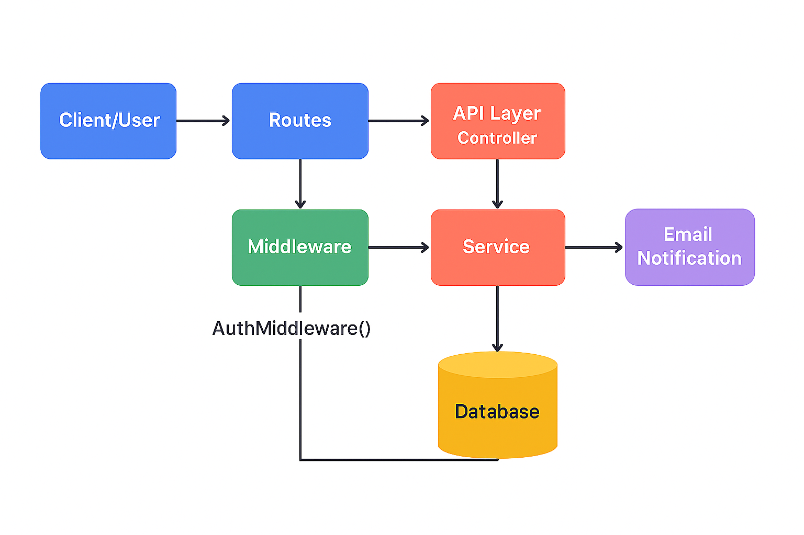

# 🧾 Inventory Management System – Backend API (Go + Gin)

A backend-only inventory management system built with Go and the Gin framework. It provides secure RESTful APIs for managing products, orders, and user authentication. Designed for scalability, modularity, and integration with any frontend or third-party system.

---

## 🚀 Features

### 🔐 Authentication
- Role-based access using middleware (`admin`, `member`)
- JWT or token-based authentication (assumed via `AuthMiddleware`)

---
Features:

1. Inuse 🟢  
   - Input: u_name, list of serial_numbers  
   - Action: Assigns serial numbers to the user  
   - Notification: Sends email to the user confirming assignment  
  

2. Instock 📦  
   - Input: list of serial_numbers  
   - Action: Removes user assignment, marks items as "In Stock"  
   - Notification: Sends email to the user confirming release  
  

3. Filer_by_user 👤  
   - Input: use_by (username in URL param)  
   - Action: Returns all serial numbers currently assigned to that user  

4. Inventory_view 📊  
   - Input: Optional query parameters (e.g. status=inuse, status=instock)  
   - Action: Returns full inventory or filtered view based on query  

5. Product & Order CRUD 🛠️  
   - Action: Supports Create, Read, Update, and Delete operations for both Product and Order entities  
   - Usage: Enables full lifecycle management of inventory items and order records  

6. Admin-only Order Access 🔐  
   - Restriction: Order-related APIs are protected and accessible only by users with admin privileges  
   - Purpose: Ensures secure handling of order operations and prevents unauthorized access  

7. Goroutine-based Email Dispatch ⚙️  
   - Implementation: Email notifications are sent asynchronously using Goroutines  
   - Benefit: Improves performance and responsiveness of API endpoints during notification handling  


### 📦 Product Management (`member` access)
| Method | Endpoint                     | Description                          |
|--------|------------------------------|--------------------------------------|
| POST   | `/Products`                  | Add a new product                    |
| GET    | `/Products/:id`              | View product by ID                   |
| GET    | `/Products`                  | View all products                    |
| PUT    | `/Products/:id`              | Update product details               |
| DELETE | `/Products/:id`              | Delete a product                     |
| DELETE | `/Instock/`                  | Mark product as in-stock             |
| POST   | `/Inuse`                     | Mark product as in-use               |
| GET    | `/Username/:use_by`          | Filter products by user              |
| GET    | `/inventory_view?status=inuse` | View inventory by status           |

---

### 📑 Order Management (`admin` access)
| Method | Endpoint         | Description               |
|--------|------------------|---------------------------|
| POST   | `/orders`        | Create a new order        |
| GET    | `/orders`        | Get all orders            |
| GET    | `/orders/:id`    | Get order by ID           |
| PUT    | `/orders/:id`    | Update order              |
| DELETE | `/orders/:id`    | Delete order              |

---

### 👤 User Authentication
| Method | Endpoint   | Description        |
|--------|------------|--------------------|
| POST   | `/Signup`  | Register new user  |
| POST   | `/Login`   | Authenticate user  |

---

## 🧱 Tech Stack

- **Language**: Go (Golang)
- **Framework**: Gin
- **Database**: MySQL
- **Architecture**: Modular (Controllers, Middleware, Routing)
- **Concurrency**: Goroutines, WaitGroups, Worker Pools (used in bulk operations)

---



## 📁 Project Structure (Simplified)

```
├── controllers/
│   ├── product_controller.go
│   ├── order_controller.go
│   └── user_controller.go
├── Dbrepository/
│   ├── order_repository.go
│   ├── product_repository.go
│   └── user_repository.go
├── middleware/
│   └── logger.go
├── models/
│   ├── product.go
│   ├── order.go
│   └── user.go
├── routes/
│   ├── product_routes.go
│   ├── order_routes.go
│   └── user_routes.go
├── Service/
│   ├── order_service.go
│   └── product_service.go
├── Token_stuff/
│   └── jwt.go
├── Dockerfile
├── docker-compose.yml
├── .env
├── main.go

